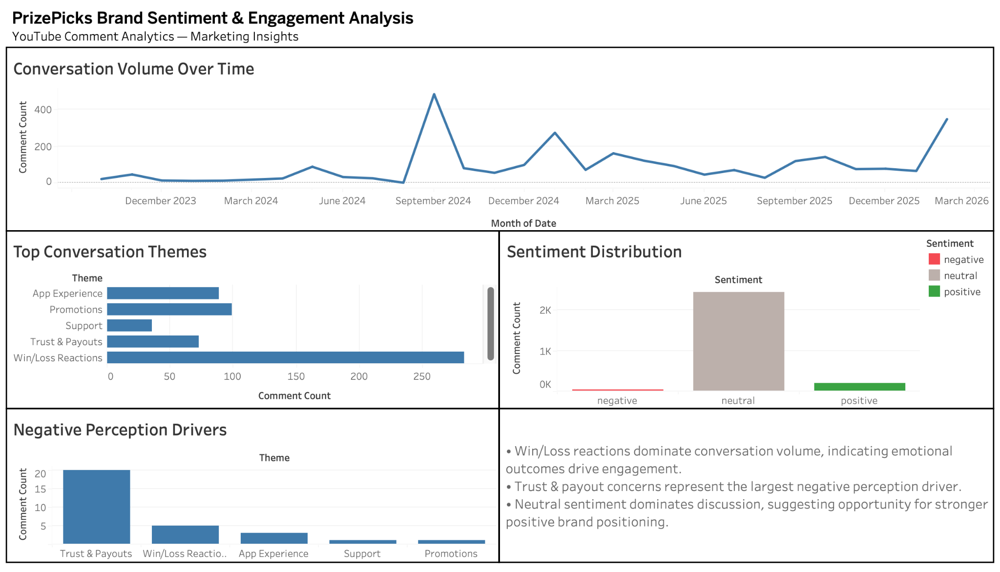

# PrizePicks Social Media Analytics Dashboard

This project analyzes public YouTube comments related to PrizePicks to understand brand sentiment, engagement patterns, and potential marketing risks.

## Tools Used
- Python
- YouTube Data API
- SQL (SQLite)
- Tableau
- Data Visualization

## Overview
The project collects social media comments using the YouTube API, processes and categorizes them into marketing-relevant themes, and visualizes insights in an interactive dashboard.

## Key Insights
- Win/Loss reactions dominate conversation volume.
- Trust and payout concerns are a major negative perception driver.
- Neutral sentiment suggests opportunity for stronger brand positioning.

## Files
- collect_youtube_comments.py → Data collection script
- daily_summary.csv → Aggregated analytics data
- Dashboard → Visualization output

## Author
Se’Deja Drigo
